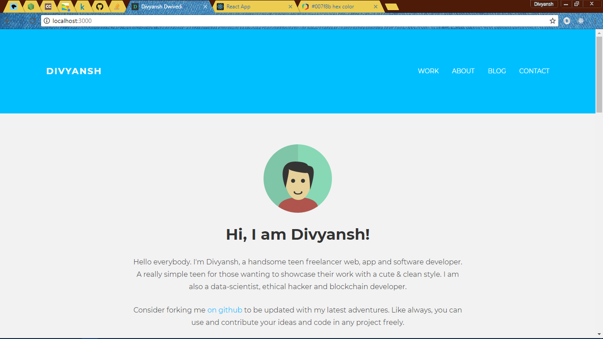
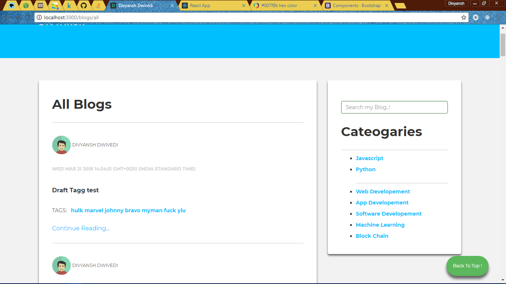
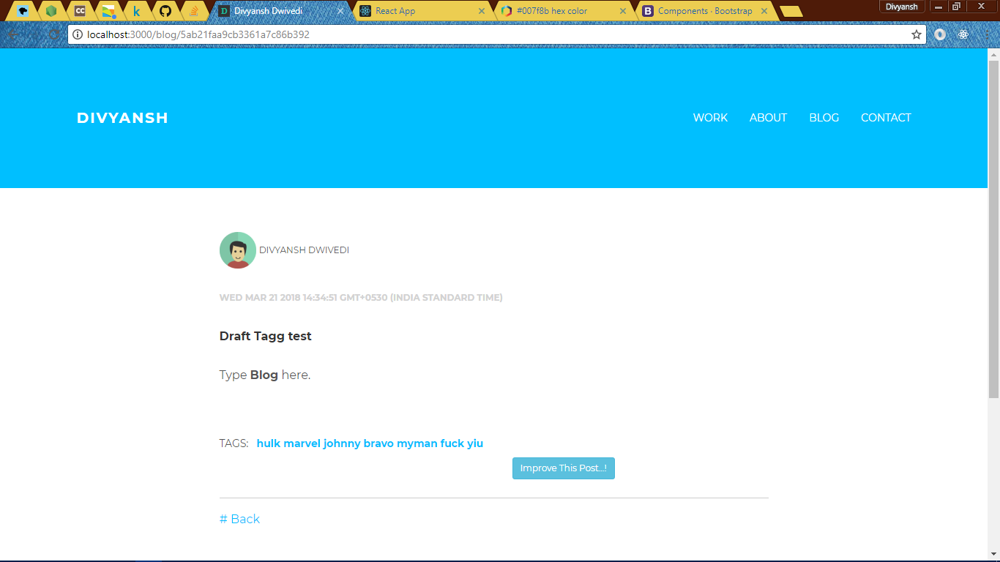
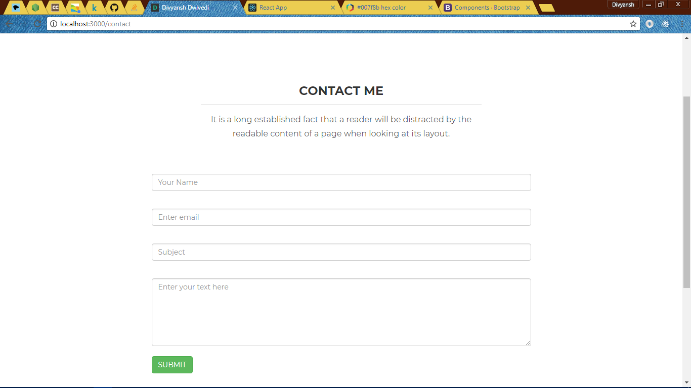
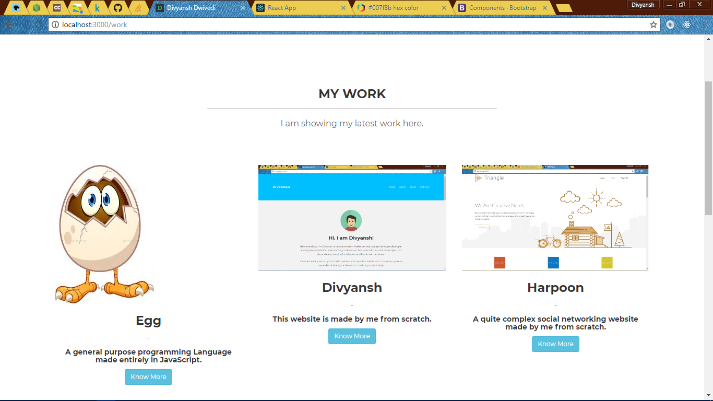
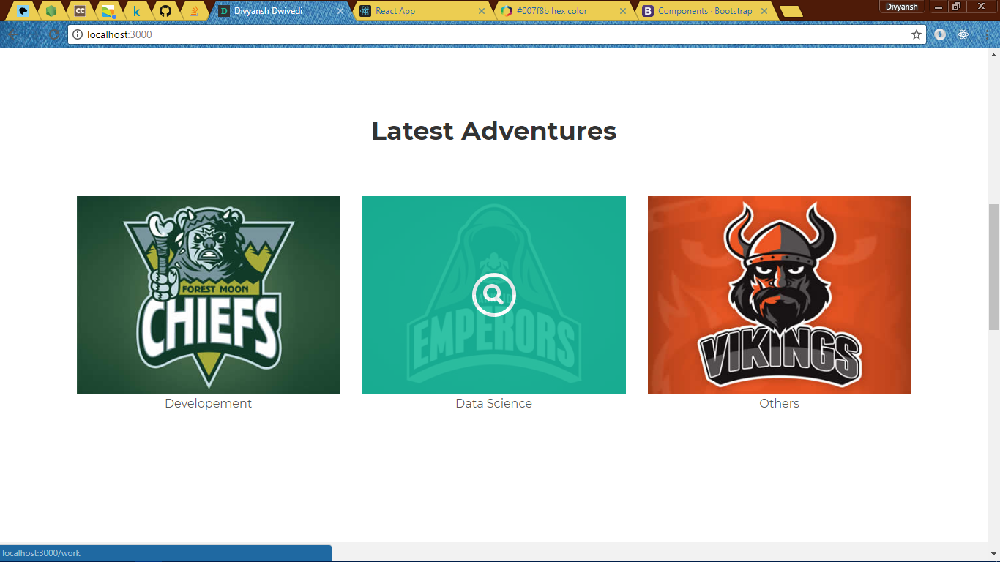
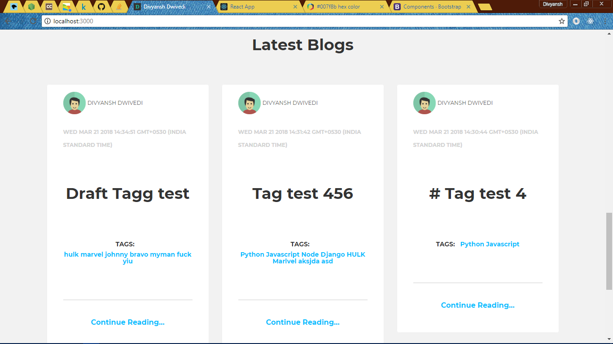
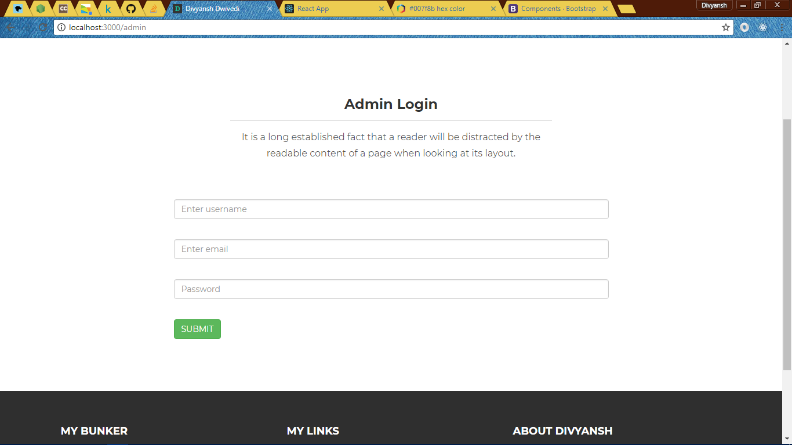
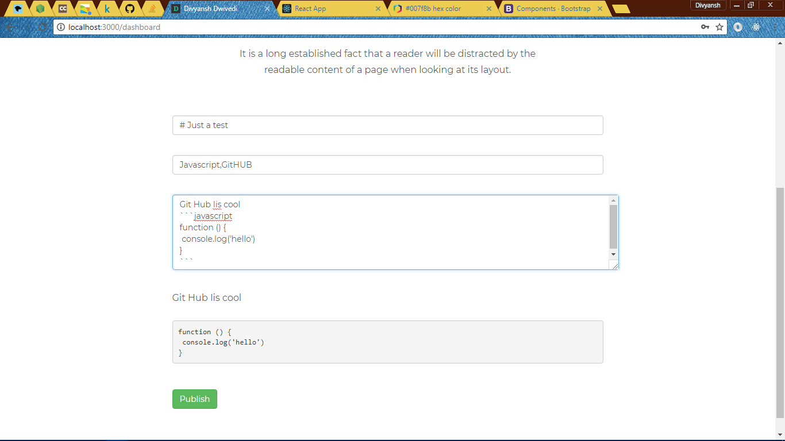

# Personal Website

This is my personal website

## Getting Started
```
* clone the repo
* make the mongo db connection 
* sign up as you the user to get the admin funcitonality.
* fire up the browser
* enjoy
```

### Prerequisites

What things you need to install the software and how to install them

```
* NodeJS
* MONGO DB
```

## Built With
```
* Javascript
* NodeJS
* MONGODB
```
## Contributing

Please contribute any code or ideas you can to improve the website.


## Authors

* **Divyansh Dwivedi** - *Initial work*

See also the list of [contributors](https://github.com/your/project/contributors) who participated in this project.

## License

This project is licensed under the MIT License - see the [LICENSE.md](LICENSE.md) file for details

## Screenshots












